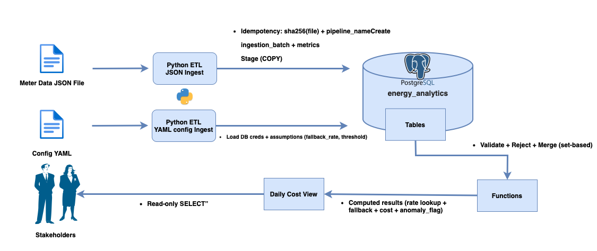

# Enerweb Energy Analytics (Local PostgreSQL)

## Project overview
This project implements a small, enterprise-style analytics pipeline for energy consumption data. It ingests daily meter readings from a JSON file and plan rate updates from a YAML file, applies effective-dated business rules, and exposes stakeholder-ready results through a read-only SQL view.

The solution is designed to be:
- **Auditable**: every load is tracked as a batch with metrics and traceable source references.
- **Idempotent**: the same input file is not ingested twice by mistake (sha256 file hash + pipeline name).
- **Data-quality aware**: invalid records are quarantined with clear rejection reasons.
- **Scalable in approach**: bulk loading (COPY) into staging tables and set-based merges into core tables.

## What it delivers
- Daily kWh readings stored in a normalized PostgreSQL schema.
- Effective-dated plan rates that apply from `effective_date` until a later update for the same `plan_code`.
- A configurable fallback rate and anomaly threshold driven from YAML configuration.
- A single view (`enerweb.v_daily_costs`) that provides daily kWh, applied rate, computed costs (cents and currency), and an anomaly flag for unusual consumption days.

## Architecture summary
The solution uses Python to ingest JSON/YAML files into PostgreSQL using a batch-controlled, idempotent workflow (sha256 + pipeline name). Data is staged via COPY, validated and merged in set-based Postgres functions, with bad rows quarantined for auditability. Stakeholders access final results through a single read-only view (`enerweb.v_daily_costs`) that computes applied rates, costs, and anomaly flags.

## Design decisions and Trade-offs

### 1) Stage → validate/reject → merge (instead of direct inserts)
**Decision:** Land raw data in staging tables (`stg_*`), validate in the database, quarantine bad rows (`reject_*`), then merge into core tables.

**Why:**
- Makes ingestion repeatable and auditable.
- Keeps raw payloads for troubleshooting.
- Enables set-based SQL validation/merge (scales better than row-by-row logic).

**Trade-off:**
- More tables and more steps than a “quick insert” approach.
- Requires cleanup/retention policy for staging and rejects.

---

### 2) File-level idempotency using sha256 + pipeline name
**Decision:** Prevent re-ingesting the same file by enforcing a unique key on `(pipeline_name, file_sha256)` in `ingestion_batch`.

**Why:**
- Avoids duplicate loads and double-counting.
- Supports safe retries (you can explicitly delete a batch to re-run if needed).

**Trade-off:**
- If you want to reprocess the same file without deletion, you need an explicit override strategy (e.g., run tags or a separate reprocess mode).
- Chunking one file into multiple batches requires additional metadata or a different uniqueness approach.

---

### 3) Bulk load with PostgreSQL COPY (instead of executemany)
**Decision:** Use `COPY FROM STDIN` to stage readings at scale.

**Why:**
- Dramatically faster for large volumes.
- Standard enterprise technique for Postgres bulk ingestion.

**Trade-off:**
- Slightly more complex code than `executemany`.
- Requires careful handling of NULLs and CSV formatting.

---

### 4) Effective-dated plan rates (no end_date stored)
**Decision:** Store plan rates as `(plan_code, effective_date, rate)` and apply the latest rate where `effective_date <= reading_date`.

**Why:**
- Matches the business rule: a rate remains active until a later update.
- Avoids maintaining end dates, which can drift or become inconsistent.
- Easy to query with a “latest before date” lookup.

**Trade-off:**
- Requires a lookup per reading when computing costs (acceptable with indexing; can be materialized later if needed).

---

### 5) Configuration in YAML + mirrored into a DB config table
**Decision:** Keep assumptions in `config.yaml`, then upsert them into `enerweb.config`.

**Why:**
- YAML is easy to manage per environment.
- Storing config in the DB allows the results view to be pure SQL and fully self-contained for stakeholders.

**Trade-off:**
- One extra sync step is needed (YAML → DB).
- Must ensure only one config row is active (enforced via `config_id = 1` pattern).

---

### 6) Read-only results via a SQL view (instead of a CLI)
**Decision:** Provide stakeholder access through `enerweb.v_daily_costs`.

**Why:**
- Minimal: one object to query.
- Read-only by nature (can grant SELECT only).
- Works with any BI/reporting tool that can query Postgres.

**Trade-off:**
- Complex logic in a view can become expensive at very high volumes (mitigated by indexing, partitioning, and materialization if needed).

---

### 7) Anomaly detection via per-customer z-score
**Decision:** Use z-score (standard deviations from customer mean) and a configurable threshold.

**Why:**
- Simple, common, and explainable.
- Normalizes per customer (different baselines).
- Threshold can be tuned in config without code changes.

**Trade-off:**
- Mean/stddev can be influenced by extreme outliers.
- Computing stats on the fly can be expensive at scale (mitigate with precomputed stats/materialized views).

---

### 8) Money representation: cents and currency output
**Decision:** Output both `cost_cents` (whole cents) and `cost_currency` (2-decimal currency units).

**Why:**
- `cost_cents` supports audit-friendly integer reporting.
- `cost_currency` is human-readable for stakeholders.

**Trade-off:**
- If rates include fractional cents, rounding to whole cents is required for `cost_cents` (explicit and consistent).

## Unusual consumption detection (per customer)

We identify unusual consumption days using a **per-customer z-score** on daily kWh.

### Method
1. For each customer, compute baseline statistics over their daily readings:
   - `avg_kwh = AVG(kwh)`
   - `stddev_kwh = STDDEV_SAMP(kwh)`
2. For each day, compute:
   - `kwh_zscore = (kwh - avg_kwh) / stddev_kwh`
3. Flag an anomaly when:
   - `ABS(kwh_zscore) >= anomaly_threshold`

`anomaly_threshold` is driven from YAML configuration and stored in `enerweb.config`, so it can be tuned without code or SQL changes.

### Why this is defensible
- It is a standard, widely understood outlier detection technique.
- It is **customer-specific**: each customer is compared to their own typical consumption (avoids one-size-fits-all thresholds).
- It is simple to explain: “How many standard deviations away from normal is this day?”
- Sensitivity is configurable via `anomaly_threshold` (a default like `3.0` is conservative and commonly used).

### Edge cases
- If a customer has too few records or no variation (`stddev_kwh` is `NULL` or `0`), we:
  - do not compute a z-score (set `kwh_zscore` to `NULL`)
  - set `anomaly_flag = 'NO'`
  
This avoids divide-by-zero errors and reduces false positives.

### Where it’s implemented
This logic is implemented in the read-only view: `enerweb.v_daily_costs`, which exposes:
- `kwh_zscore`
- `anomaly_flag` (`YES`/`NO`)

## Handling larger volumes and performance adjustments

This solution is built with a scalable pattern (stage → validate/reject → merge), but some parts should be adjusted as volumes grow.

### What already scales well
- **Bulk staging with COPY**: loading into `enerweb.stg_meter_reading` uses PostgreSQL `COPY`, which is much faster than row-by-row inserts.
- **Set-based database finalization**: validation, rejects, and merges are done in SQL against whole sets, not iterative application logic.
- **Effective-dated rates**: the rate lookup logic scales well when supported by the right index on `(plan_code, effective_date)`.

### What to adjust for very large datasets

#### 1) Partition the fact table by date
As `enerweb.meter_reading` grows, partition by time (monthly or weekly) on `reading_date`:
- Improves query performance for date ranges.
- Keeps indexes smaller and faster.
- Makes retention and backfills easier.

#### 2) Index for the dominant query patterns
Add/maintain indexes aligned to how results are queried:
- `(customer_id, reading_date)` for stakeholder queries by customer and date range.
- `(meter_id, reading_date)` for uniqueness and meter-level access.
- `(plan_code, effective_date)` for rate selection.

#### 3) Avoid full-table stats computation in the view
The current anomaly logic computes `AVG` and `STDDEV` per customer from `meter_reading`. At high volume, this becomes expensive.

Options:
- Maintain a **materialized table** of customer stats (avg/stddev) updated per batch.
- Or create a **materialized view** refreshed on a schedule.
- For near-real-time dashboards, compute daily aggregates and stats incrementally.

#### 4) Stream large JSON rather than loading all into memory
For very large input files:
- Prefer **JSONL (newline-delimited JSON)** to stream records line-by-line.
- Or use a streaming JSON parser so the ingestion process does not load the entire file into memory.

#### 5) Batch finalization strategy
For extremely large loads:
- Finalize in controlled chunks (e.g., per day, per meter range, or per file shard) while keeping file-level idempotency.
- Keep staging tables “append-only per batch” and truncate them after successful merges to reduce storage pressure.

#### 6) Operational retention
Keep staging and reject tables manageable:
- Retain staging data for a limited window (e.g., 7–30 days).
- Retain rejects longer (e.g., 90 days) depending on audit requirements.
- Archive older batch metadata if needed.

The core approach (COPY → staging → set-based finalize → read-only view) remains valid at higher volumes. For very large datasets, the main improvements are partitioning, targeted indexing, precomputed anomaly statistics (materialization), and streaming input rather than loading entire files into memory.